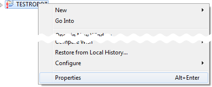
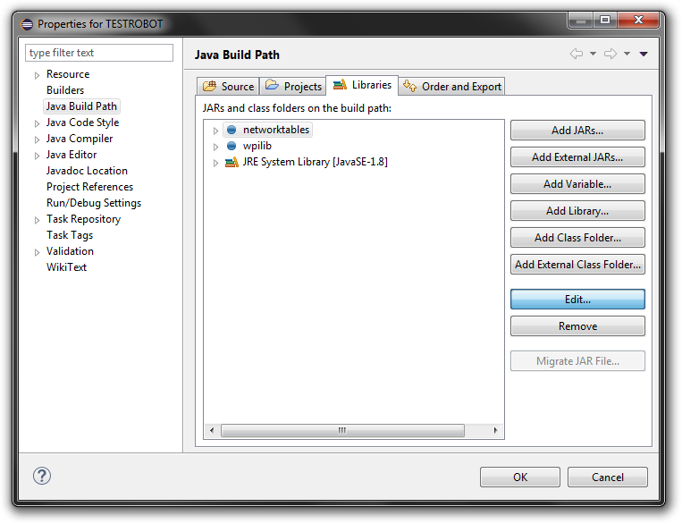
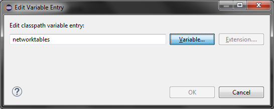
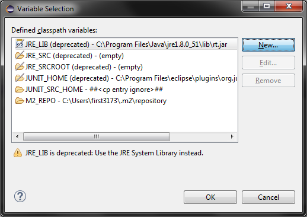

Our team runs into this every year, and every year I forget how to fix it:

I decided that this is the year I'll write it down. (Probably now that I've documented it they'll fix it next year.)

<!--more-->

1. Right-click on the project in the Package Explorer, and select "Properties".
   
2. Go to "Java Build Path", then the "Libraries" tab.
   Select either 'networktables' or 'wpilib' (it doesn't matter which) and click the "Edit..." button.
   
3. In the "Edit Variable Entry" dialog, click the "Variable..." button.
   
4. In the "Variable Selection" dialog, click "New..."
   
5. In the "New Variable Entry" dialog, enter `wpilib` for the name, then click the "File..." button and navigate to "WPILib.jar". (It should be in <code><var>your home folder</var>/wpilib/java/current/lib</code>.)
   
6. Click OK, then repeat steps 4 and 5. In step 5 enter
   <table class="table table-condensed">
      <tr><td>Name:</td><td><code>networktables</code></td></tr>
      <tr><td>Path:</td><td>NetworkTables.jar **Note for 2018:** NetworkTables.jar has been renamed to ntcore.jar</td></tr>
   </table>
7. Click OK to all the dialog boxes you now have open.

That's it! The unbound classpath errors should now be gone.
