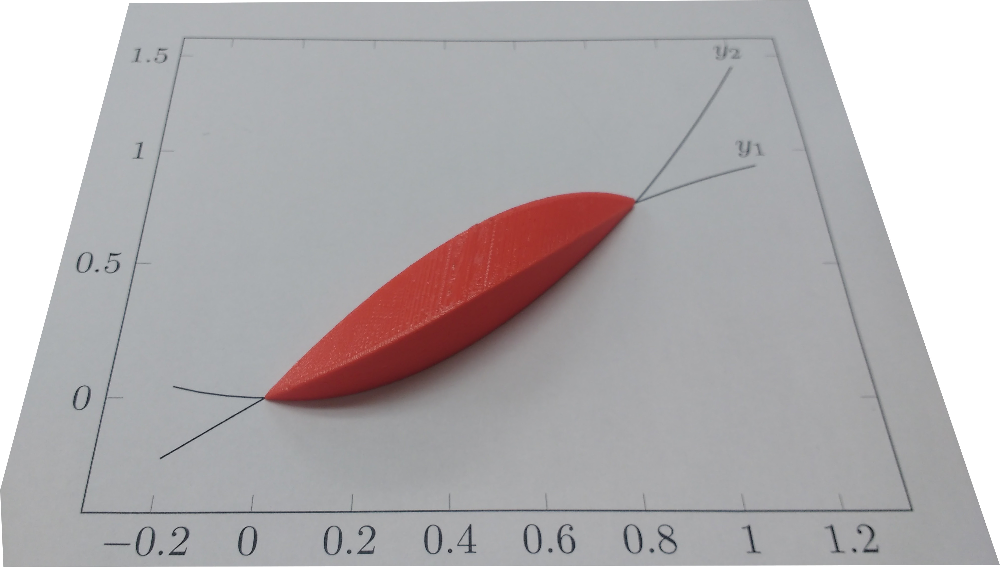
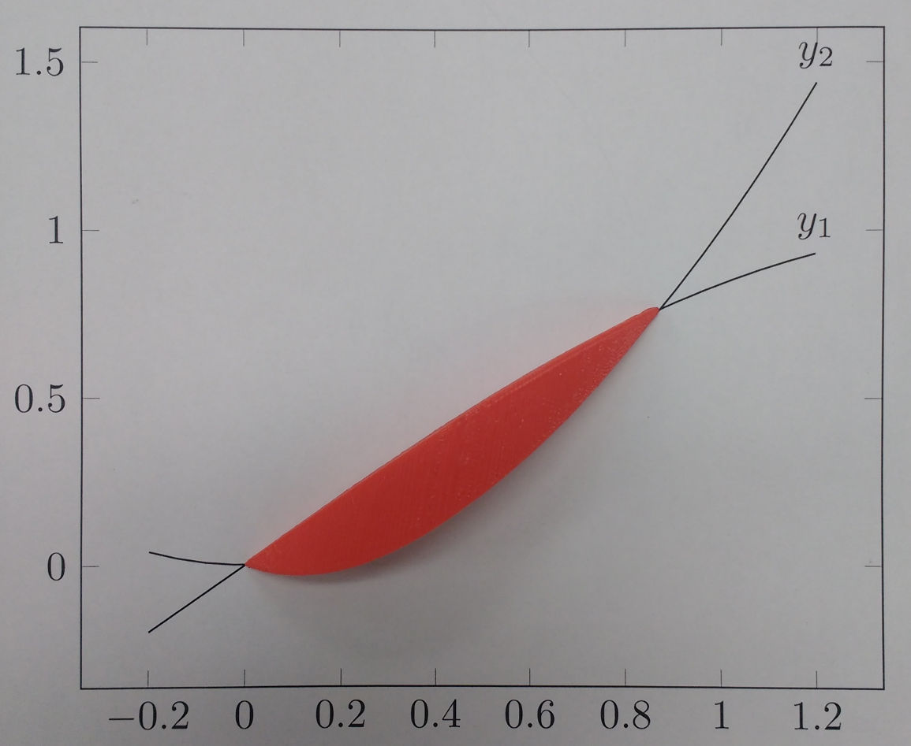

<figure style="float:right;margin:30px 0"></figure>

A friend wanted to 3D-print a shape to demonstrate using calculus to find the volume of solids of known cross-section.
The shape he wanted was a graph of $sin(x)$ vs $x^2$,
where each vertical slice of the intersection was a square.
Here's the graph, with $y_1 = sin(x)$ and $y_2 = x^2$. The blue lines show the edge of each square.
He couldn't figure out how to do this in a CAD program (I'm not even sure if it's possible),
so he asked me if I could write some code to render it.

This post was written in literate Python. Download <a href="/blog/post/python-3d-rendering/buildshape.py">buildshape.py</a> and run it yourself!

<!-- XXX WARNING XXX: This post (and its ancillary files) was auto-generated from a source file! See the README in the post's directory for information before editing this file. -->
<!--more-->

The first attempt I made was written directly in [OpenSCAD](http://www.openscad.org/);
I wrote a small loop to union together a collection of `cube()` calls, one for each slice.
This had several problems, however.
First, because I was using cubes it looked very chunky unless the slices were very small.
Second, I ran into [a bug in OpenSCAD](https://github.com/openscad/openscad/issues/350)
which causes something like $O(n^2)$ performance for this scenario
and the file took about 2 hours to render.
Finally, the STL file it emitted was 1.8 MB and crashed the slicer.

Clearly, this solution was not going to work.
Instead, I wrote a python script to output an OpenSCAD file containing a single polyhedron,
which I could then render into an STL file and hand off to him to slice and print.
In addition to not crashing the slicer,
this approach also had the advantage of allowing the resolution to be much coarser
while still avoiding the 'stair-step' problem of the original multiple `cube()` approach.

## Setting up
First, the formulae:

<figure class="highlight python"><table><tr><td class="gutter"><pre>38 39 </pre></td><td class="code"><pre>def y1(x): return math.sin(x) def y2(x): return x*x </pre></td></tr></table></figure>

$sin(x) = x^2$ is true for $x = 0$ and $x \approx 0.876$, so that's where I'll start and stop.

<figure class="highlight python"><table><tr><td class="gutter"><pre>42 43 </pre></td><td class="code"><pre>START = 0 END = 0.876726 </pre></td></tr></table></figure>

I'll draw 50 slices, and scale everything up by 30.

<figure class="highlight python"><table><tr><td class="gutter"><pre>46 47 </pre></td><td class="code"><pre>SLICES = 50 SCALE = 30 </pre></td></tr></table></figure>

OpenSCAD's [`polyhedron()` function](https://en.wikibooks.org/wiki/OpenSCAD_User_Manual/Primitive_Solids#polyhedron)
takes two arguments, `points` and `triangles`.
(Versions 2014.03 and later can also take `faces` instead of `triangles`, but I'm still using 2014.01.)
`points` is a list of $[x, y, z]$ triplets, and `triangles` then indexes into the list of points to build the triangles.
I therefore make a function <code>point(<var>x</var>, <var>y</var>, <var>z</var>)</code>
which will save the point into the list and return the index into this list.
Most of the program then works using these indexes, rather than the actual point coordinates.

<figure class="highlight python"><table><tr><td class="gutter"><pre>56 57 58 59 </pre></td><td class="code"><pre>points = [] def point(x, y, z): 	points.append( (x*SCALE,y*SCALE,z*SCALE) ) 	return len(points)-1 </pre></td></tr></table></figure>

## Slicing the shape

<figure style="float:right;margin:30px 0"></figure>
The first step is to slice the shape and get a list of squares.
(OpenSCAD expects the points on a triangle to be clockwise when looking at them from the outside,
so throughout the program I maintain this clockwise orientation.) Here's the square; line $\overline{P_2 P_3}$ is the part of the square that sits on the graph. The remainder of the square sits above it.

I slice the shape into <code>SLICES</code> slices, and output the above square for each slice.
This is also where I convert the coordinates into point-list indexes as explained above.

<figure class="highlight python"><table><tr><td class="gutter"><pre>68 69 70 71 72 73 74 75 </pre></td><td class="code"><pre>def get_slices(): 	for x in scipy.arange(START, END, (END-START)/SLICES): 		yield ( 			point(x, y1(x), y1(x)-y2(x)), 			point(x, y2(x), y1(x)-y2(x)), 			point(x, y2(x), 0), 			point(x, y1(x), 0), 		) </pre></td></tr></table></figure>

## Building the polyhedron
All of these slices I have are *inside* the shape,
which isn't the part that's visible.
The next step is to get all of the faces of the polyhedron
by connecting the edge of adjoining slices into quadrilaterals.

First, I make an "end cap" using the slice at the start of the shape.
This is necessary because otherwise the end will be left 'open' if the first slice is not of size 0,
and the shape [cannot be exported](https://en.wikibooks.org/wiki/OpenSCAD_User_Manual/STL_Import_and_Export#STL_Export_2)
because it is not a valid 2-manifold.

<figure class="highlight python"><table><tr><td class="gutter"><pre>90 </pre></td><td class="code"><pre>yield slices[0] </pre></td></tr></table></figure>

<figure style="float:right;margin:30px 0"></figure>

Next I generate quadrilaterals conecting each of the sides of ajoining slices.
Doing this is relatively simple:

$$
\mbox{Given slices}
\substack {
	\square T_0 T_1 T_2 T_3 \\
	\square P_0 P_1 P_2 P_3
}
\mbox{, emit faces}
\substack {
	\square T_0 P_0 P_1 T_1 \\
	\square T_1 P_1 P_2 T_2 \\
	\square T_2 P_2 P_3 T_3 \\
	\square T_3 P_3 P_0 T_0
}.
$$

(Notice that they all go clockwise when facing outward.)

<figure class="highlight python"><table><tr><td class="gutter"><pre>111 112 113 114 115 116 117 118 119 120 </pre></td><td class="code"><pre>for this in slices[1:]: 		def face(a, b): return ( 			this[a], prev[a], 			prev[b], this[b], 		) 		yield face(0, 1) 		yield face(1, 2) 		yield face(2, 3) 		yield face(3, 0) 		prev = this </pre></td></tr></table></figure>
The last step in making the polyhedron is to cap off the back end the same as I did with the front end (see above).

<figure class="highlight python"><table><tr><td class="gutter"><pre>122 </pre></td><td class="code"><pre>yield prev </pre></td></tr></table></figure>

## Convert quadrilaterals into triangles

<figure style="float:right;margin:30px 0"></figure>

I now have a list of faces for the polyhedron. For newer versions of OpenSCAD I could just pass this list in to the `polyhedron()` function; unfortunately as I mentioned before my version of OpenSCAD only accepts a list of triangles.
Therefore, I take each face (a quadrilateral $\square F_0 F_1 F_2 F_3$) and divide it into two triangles, $\triangle F_0 F_1 F_3$ and $\triangle F_1 F_2 F_3$. (Again, I'm being very careful to keep them in clockwise order.)

<figure class="highlight python"><table><tr><td class="gutter"><pre>128 129 130 131 </pre></td><td class="code"><pre>def get_triangles(): 	for face in get_faces(): 		yield (face[0], face[1], face[3]) 		yield (face[1], face[2], face[3]) </pre></td></tr></table></figure>

## Write the file
Finally, I print out the OpenSCAD file, which simply consists of a single call to `polyhedron()`:

<figure class="highlight python"><table><tr><td class="gutter"><pre>135 136 137 138 139 140 141 142 143 144 145 </pre></td><td class="code"><pre>print "polyhedron(" print "	convexity = 1," print "	triangles = [" for triangle in get_triangles(): 	print "		[{0}, {1}, {2}],".format(*triangle) print "	]," print "	points = [" for point in points: 	print "		[{0}, {1}, {2}],".format(*point) print "	]" print ");" </pre></td></tr></table></figure>

And finally, here's what the shape looks like when it's printed out.
In addition to the Python program linked at the top of this post,
you can also download
[the OpenSCAD file](shape.scad) and
[the STL file](shape.stl).

